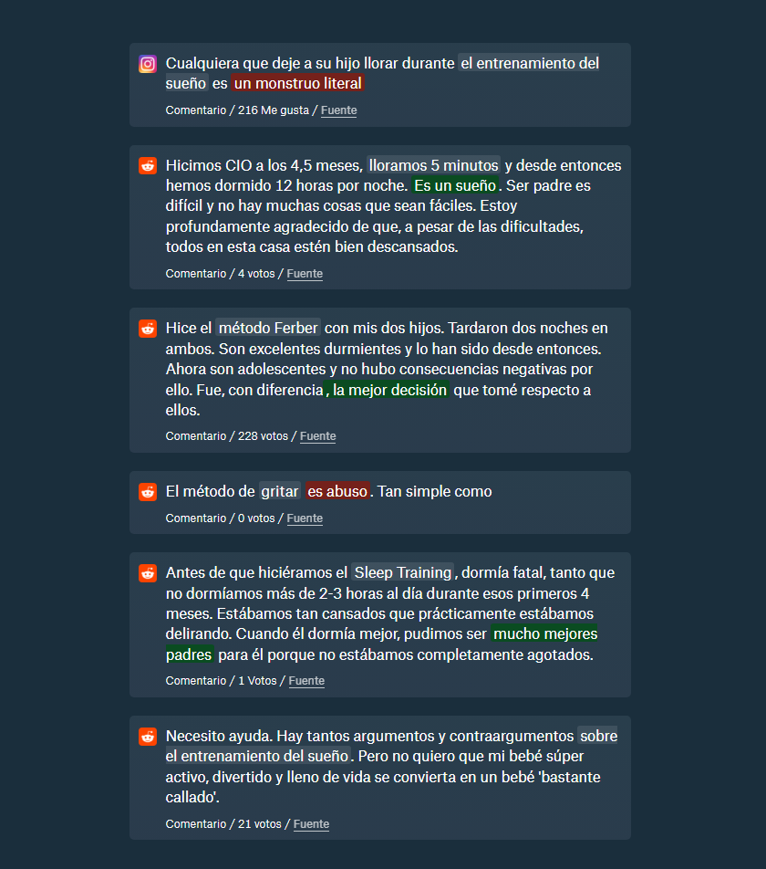
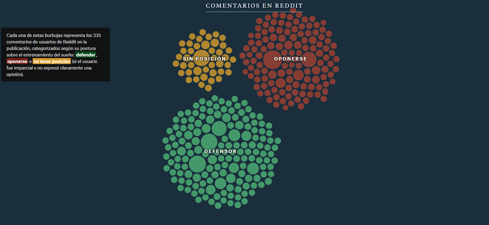
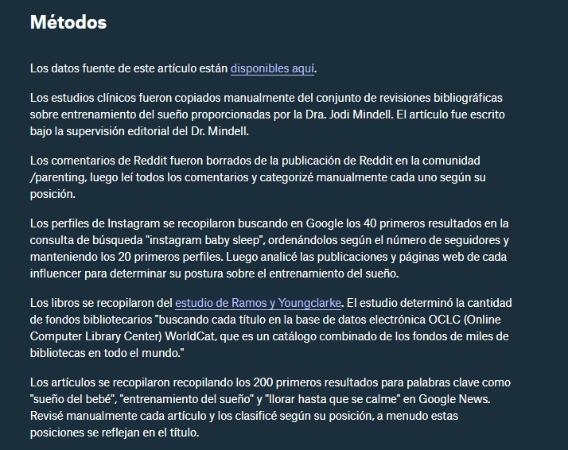

# Análisis de la web story: Is Sleep Training Harmful? (¿Es perjudicial el entrenamiento del sueño?)

**Autor:** Tom Vaillant

**Medio de publicación:** The Pudding

**Enlace a la web story:** https://pudding.cool/2024/07/sleep-training/

## 1. Descripción sobre la web story: "Entrenamiento del sueño"

> "El entrenamiento del sueño infantil se ha convertido en uno de los debates más polarizados en la crianza moderna, una discusión digital que oscila entre la desesperación y la culpa."

  
   
  <em>Figura 1: Representación visual del debate en plataformas digitales (Reedit).</em>

 

El reportaje explora a dos bandos, aquellos quienes apoyan esta práctica y a los que la repudian. Esta práctica que pone en jaque un dilema ético y científico a los padres/cuidadores en la crianza contemporánea, el llamado: "Entrenamiento del sueño" en menores; La cual se basa en dejar que los bebés e infantes lloren en un entorno seguro hasta que se duerman, incluso pudiendo llorar hasta alrededor de una hora en sus inicios. Todo el proceso inicialmente dura entre tres y siete días. 

Este fenómeno se ha visto masificado exponencialmente en el entorno digital.
La historia no se limita a describir el problema que ya existe, sino que utiliza una gran variedad de datos masivos, conectando tanto opiniones, bibliografía y contenido audiovisual de forma enriquecedora a poder entender el debate, que opina la gente y realmente cuanto sustento científico hay (o no) respecto a la rutina de sueño en menores. Utilizando imágenes, comentarios e información de Reedit e Instagram como a su vez videos de TikTok, es que se nos presenta los distintos matices y opiniones a esta problemática, apelando no solo a los números e información (que suman bastante) pero también apelan a la emocionalidad del lector, usando citas y videos. 
A continuación, algunos ejemplos visualizados del sitio.

  
   
  <em>Figura 2: El influencer y fisicoculturista Chris Bumstead habla al respecto del entrenamiento de sueño (haz clic en la imagen para ver el video original).</em>

 

Exponiendo estas opiniones cualitativas en principio son agrupadas finalmente en datos cuantitativos, transformándose en información más fácil de digerir con el uso de gráficos. El foco central es contrastar la presión social que ejercen los "influencers" en plataformas sociales, con respecto a la evidencia y el consenso médicocientífico respecto a los métodos para ayudar a los bebés a dormir de forma independiente, con la investigación detrás de las fuentes usadas, la cantidad de investigaciones al respecto e incluyendo una investigación respecto a comparaciones entre niños criados con y sin esta práctica.

  
   
  <em>Figura 3: Posicionamiento de datos cuantificados sobre el debate en Reddit.</em>

 

## 2. Interés narrativo, estructura y una duda genuina

Mi interés por analizar esta pieza en particular nace de una duda genuina hacia un debate que resulta poco común en mi día a día. Como estudiante de periodismo, en mis intereses esta la constante búsqueda sobre temas de salud y ciencia, y scrolleando por la web de pudding me tope con esta web story de la cual desconocía totalmente la práctica. Es un tema que quizás no habría explorado proactivamente a menos que fuese padre o cuidador. Pero que propone un tema interesante de leer y aprender, como lo es el basto y pobre sueño de los padres debido a la crianza en sus primeras etapas.

Me resultó llamativo observar cómo la historia aborda una práctica que, en ciertos rincones de internet (específicamente en foros de Reddit y comunidades de Instagram), se cataloga como poco ética o hasta cruel. La web story toma esta premisa altamente emocional y la transforma en una gran narrativa usando datos duros. Esto permite al usuario navegar por el conflicto mezclando opiniones y datos sin perder objetividad ni haciéndose parte de la discusión.

Desde la perspectiva de la estructura narrativa y la interacción con el usuario, destaco cómo el autor busca construir empatía en sus inicios. La historia fluye orgánicamente guiando al lector desde lo más micro (la frustración de una madre intentando dormir a su hijo frente a un video de TikTok) hacia lo macro (el análisis de cientos de comentarios y estudios). La transición logra mantener al usuario involucrado, siendo parte de una historia. Logrando que el equilibrio entre el texto; que es conciso y directo, y las imágenes dinámicas, invite a seguir haciendo scroll al lector.

## 3. Efectividad visual, calidad de los datos

El sitio destaca enormemente por la calidad audiovisual en que despli9ega la información. Logran resolver de forma inteligente la forma de clasificar y graficar las posiciones que están a favor, a quienes están en contra y a las distintas posiciones frente a este "ritual" de sueño en el infante. Por ejemplo, aunque podrían haber trabajado esa agrupación de datos con gráficos tipo pastel o de barras, hubiese sido muy tosco de leer y entender para l agente común. Sin embargo, al mostrarlo con gráficos de estilo enjambre (desconozco sui es el termino correcto, pero fue lo más símil que encontré investigando) se resolvió de buena forma, inclusive siendo más intuitivo teniendo la opción de un mayor desglose de información al pasar el cursor sobre estos. 

Sin embargo, el punto fuerte y mayor que le concedo a esta web story es en la calidad de fuentes y trabajo de los datos. Hacen un trabajo extenso al respecto de distintos datos; bibliográficos, comentarios de redes, líneas temporales de investigaciones científicas sobre el tema, y todas estas con el respaldo o enlaces para poder verificarlos de forma propio si uno así lo quiere. Innova gratamente al ahcer un seguimiento a fondo sobre por ejemplo el sustento de fuentes y citas utilizados por la parte opostora de redes sociales se sustenta casi exclusivamente en las teorías de dos autores específicos. Lo que hace esta web story, aportando un gran valor periodístico, es que al contrastar la literatura y revisar las citas de estos mismos referentes, demuestra visualmente que sus argumentos están descontextualizados. No existe una correlación real, ni autores científicos que desaprueben esta práctica cuando se aplica en el contexto clínico correcto del sueño infantil.

La visualización de esta desmitificación es clave: desarma la desinformación de un vistazo. Al final, y esto queda plasmado de manera muy coherente en la narrativa, la conclusión es que el entrenamiento del sueño queda a elección particular de la familia. La historia sugiere, de forma sutil pero respaldada por la evidencia, que la resistencia actual a esta práctica podría ser parte de un cambio cultural más amplio que se está gestando, muy similar a la controversia que ocurrió en su momento histórico con la adopción de la leche de fórmula.

  
   
  <em>Figura 4: Respaldo de la metodología aplicada para la recolección y análisis de datos en la investigación.</em>

 
